# jim.klonow.ski

Personal health tracking site. Bloodwork trends, body composition, and a daily peptide/TRT journal, with AI-generated recaps, Whoop sync, and role-based sharing — all in one place.

**▶ [Try the live demo](https://jim.klonow.ski/demo)** — no sign-up. One click drops you into the full app as a fictional persona with ~20 months of synthetic data: browse everything, edit journal days, open vials. Demo edits land in a shared sandbox database that resets nightly; nothing you see or touch is real health data.

## Screenshots

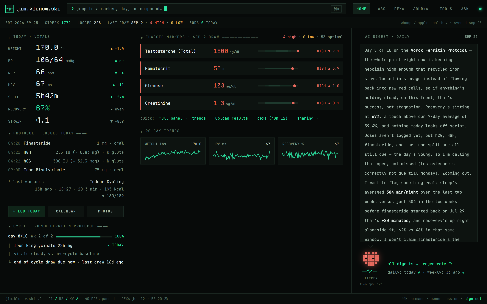

| `/labs` — bloodwork tracker | `/labs/dexa` — body composition |
|---|---|
| 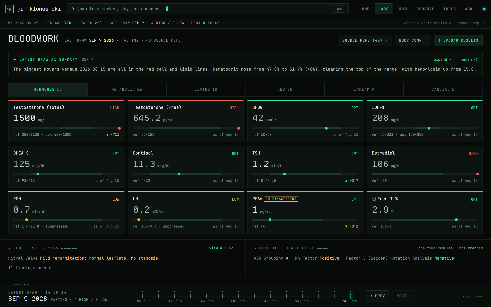 | 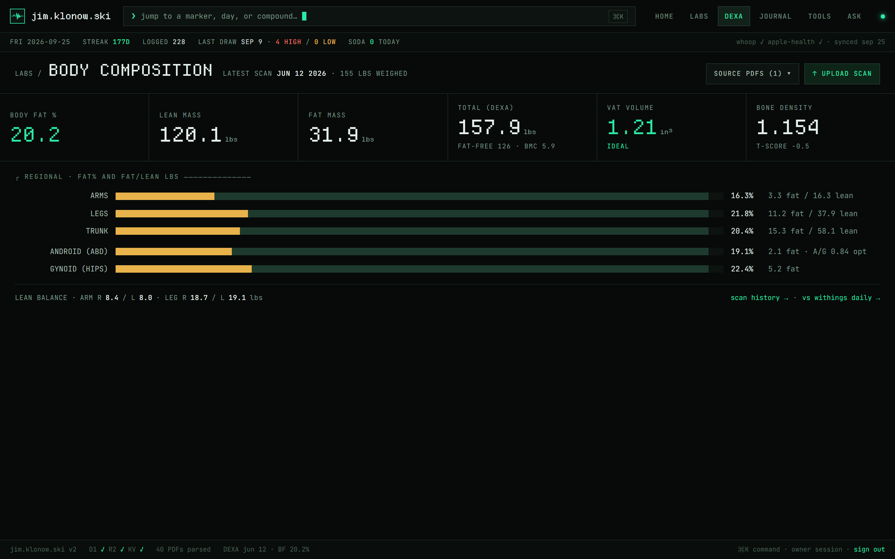 |
| **`/journal` — daily log hub** | **`/journal/trends` — vitals + Whoop** |
| 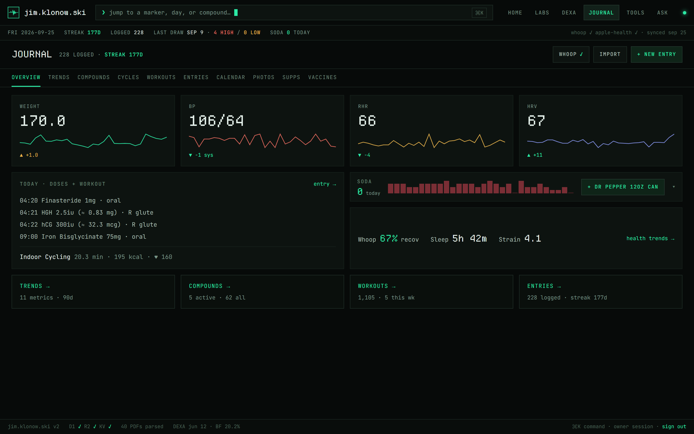 | 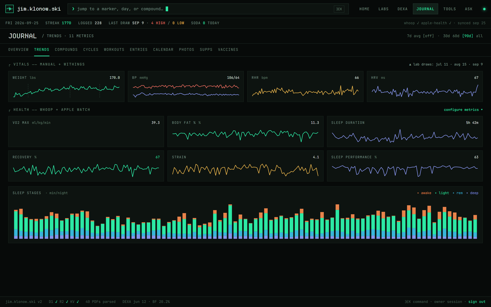 |
| **`/ask` — AI analysis console** | |
| 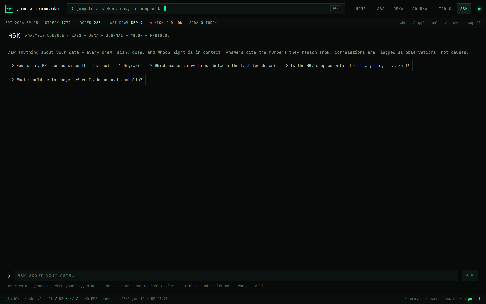 | |

<details>
<summary><strong>More pages — journal spokes &amp; tools</strong></summary>

| `/journal/compounds` — active protocol + timeline | `/journal/workouts` — Apple + Whoop session log |
|---|---|
| 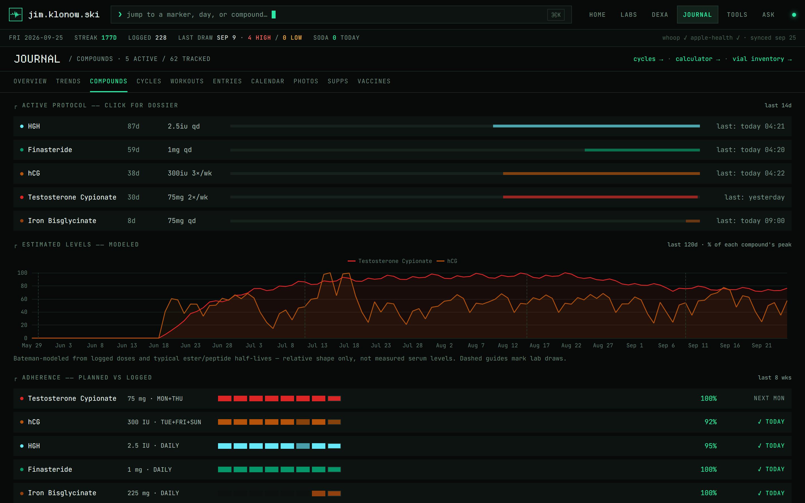 | 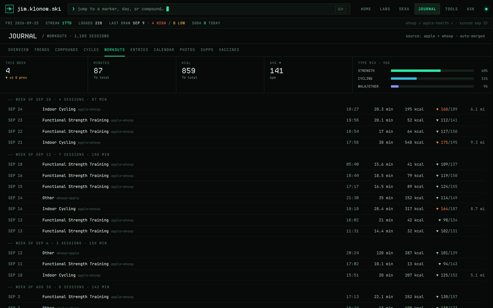 |
| **`/journal/cycle/[id]` — cycle dossier** | **`/journal/cycles` — cycle planner** |
| 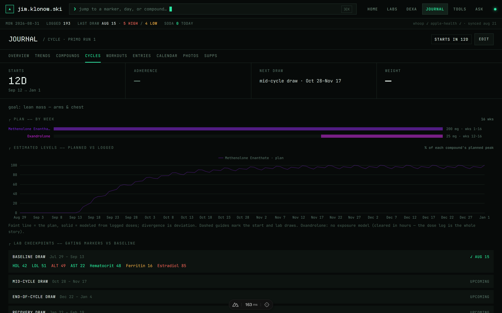 | 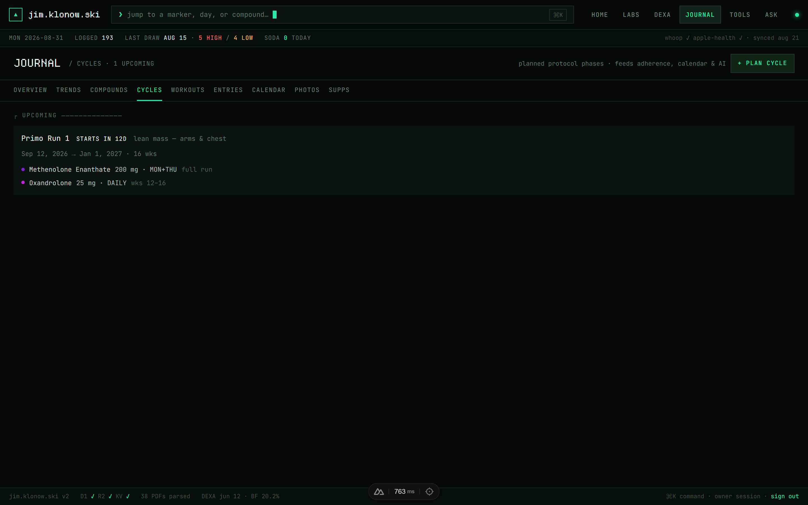 |
| **`/journal/entries` — day-log ledger** | **`/journal/calendar` — month view + protocol timeline** |
| 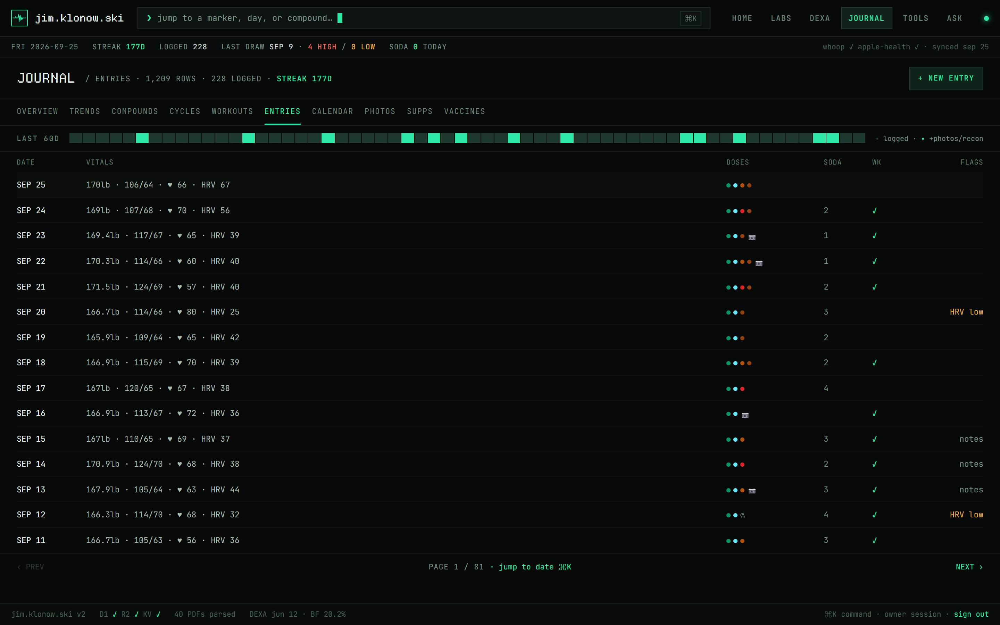 | 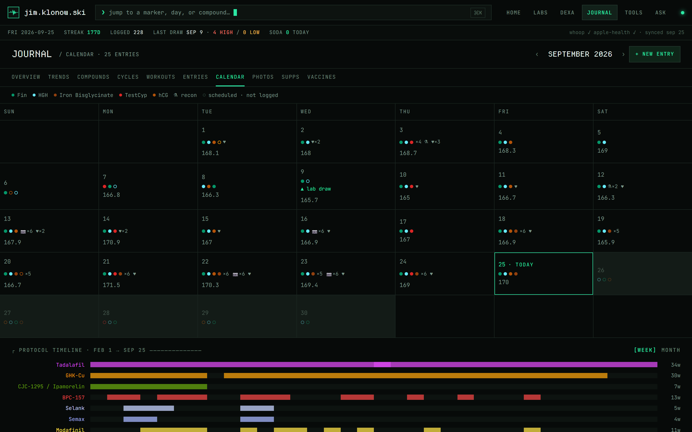 |
| **`/journal/supplements` — standing stack** | **`/tools/calculator` — reconstitution & syringe units** |
| 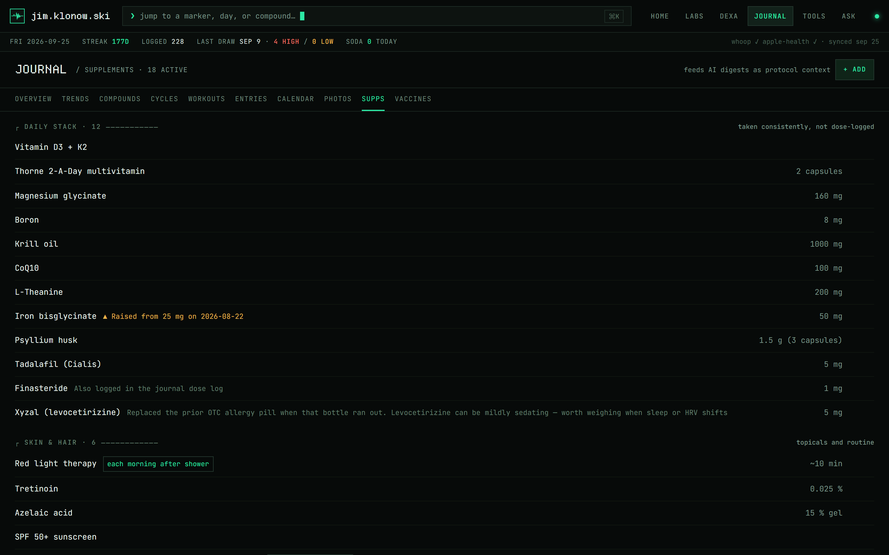 | 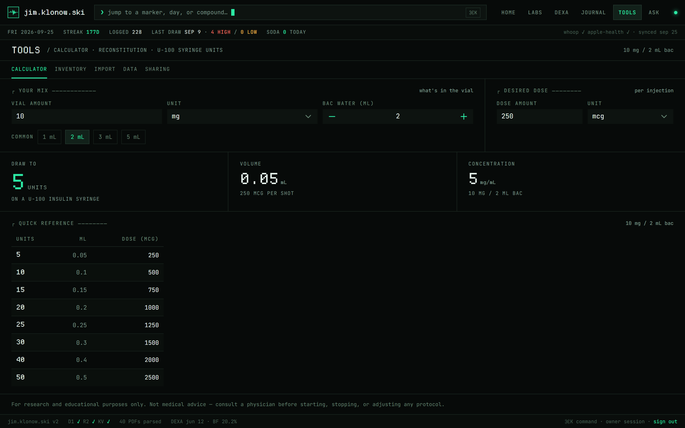 |
| **`/tools/sharing` — role-based share links** | **`/tools/import` — Apple Health import + auto-sync** |
| 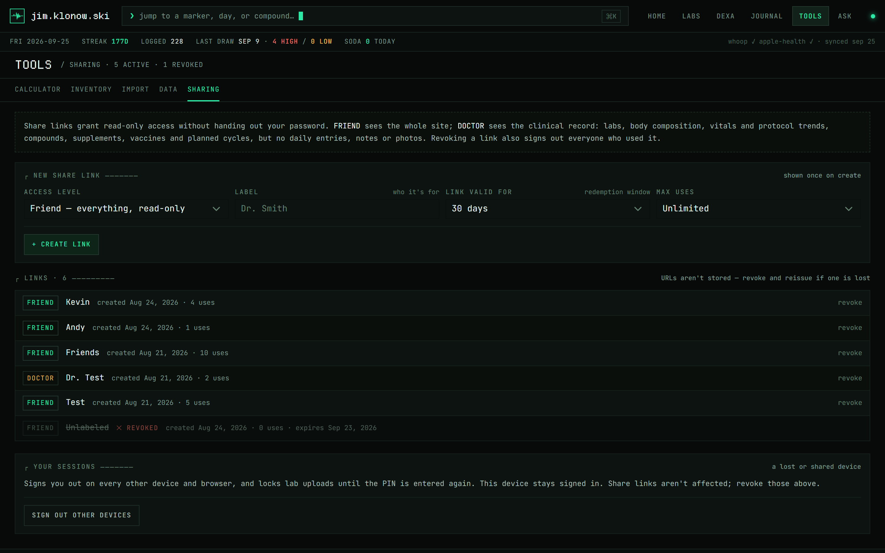 | 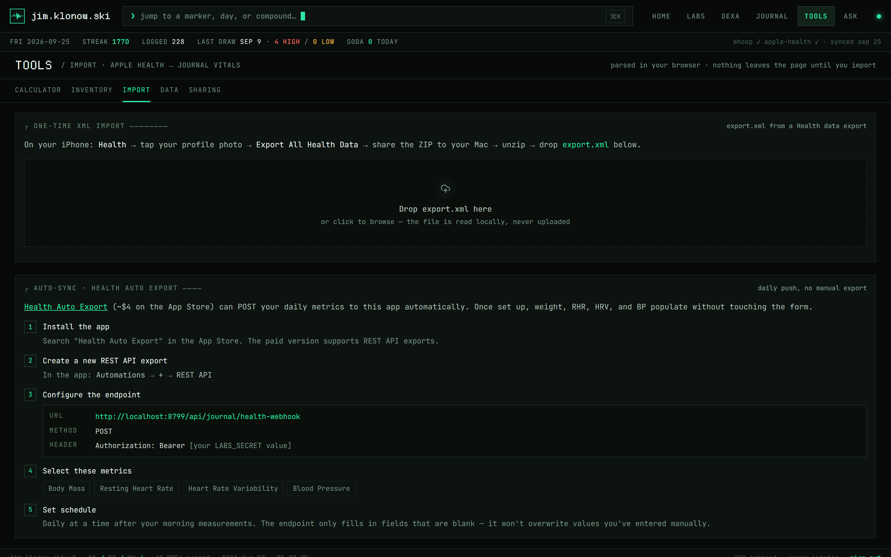 |

</details>

## Stack

- **Nuxt 4** + Vue 3 + TypeScript
- **Nuxt UI v4** + Tailwind CSS v4 — "Phosphor Terminal" dark-only TUI theme (JetBrains Mono / Departure Mono)
- **Installable PWA** — standalone display, afib-heartbeat icon set (`public/`), iOS homescreen metas in `app/app.vue`
- **Cloudflare Workers** — deployed via Wrangler (nodejs_compat)
- **Cloudflare D1** — primary data store (journal, labs, DEXA, health metrics, workouts, cycles, digests, share invites)
- **Cloudflare R2** — lab PDF and progress photo storage
- **Cloudflare KV** — rate limiting
- **nuxt-echarts** — trend charts
- **Anthropic SDK** — server-side lab PDF parsing, protocol-aware lab summaries, daily/weekly health digests, and the `/ask` chat
- **Whoop API** — OAuth sync for recovery, sleep, and workout data

## Sections

| Route | Description |
|---|---|
| `/` | Overview dashboard — flagged markers, vitals, today's doses + the latest day's workouts, quick links, and a cycle strip when one is planned/running/recently ended (sign-in prompt when signed out) |
| `/labs` | Bloodwork tracker — biomarker panels, trend charts, PDF sources, regenerable AI summaries; `?marker=<key>` deep-links to a marker's tab + detail modal (used by the home page's flagged rows and the ⌘K palette) |
| `/labs/dexa` | DEXA body composition scans |
| `/labs/upload` | Upload a new lab PDF (parsed server-side into structured markers) — owner only |
| `/labs/login` | Owner password sign-in |
| `/share/[token]` | Public landing that exchanges a share link for a role session |
| `/journal` | Hub — vital tiles with sparklines, today's doses + workout, soda/Whoop strip, and cards into each spoke below |
| `/journal/trends` | Every vitals + Whoop/Apple Watch chart under one shared range picker (30/60/90d/all, optional 7d smoothing) |
| `/journal/compounds` | Active protocol and every tracked compound — modeled exposure curves for the slow-release injectables (Bateman superposition of the dose log, lab draws overlaid) and a planned-vs-logged adherence panel scoring the standing cadence plus any planned cycles — linking out to the calculator and vial inventory |
| `/journal/cycles` | Cycle planner — named, dated protocol phases (e.g. "200 mg Primo weeks 1–16, Anavar weeks 12–16") stored week-relative to the start date, so shifting the start moves every phase; editing owner only |
| `/journal/cycle/[id]` | Cycle dossier — plan bars by week, planned-vs-logged exposure overlay (the plan run through the same Bateman engine as the dose log), per-week adherence, derived lab checkpoints (baseline/mid/end/recovery windows) with gating-marker deltas vs the baseline draw, end-early/resume actions |
| `/journal/workouts` | Session log merged from Apple Health + Whoop, with stat cells and type mix |
| `/journal/entries` | Day-log ledger of every journal row — hidden from the doctor role |
| `/journal/[date]` | Create or edit a day's entry (read-only for guests) |
| `/journal/calendar` | Month view with compound-colored dots, scheduled-dose rings (planned vs logged, from the hand-maintained `PROTOCOL_RULES` cadence merged with any planned cycles — an upcoming cycle previews its rings on future days) + protocol timeline (logged compounds, plus standing meds backfilled from the `STANDING_COMPOUNDS` constant) |
| `/journal/photos` | Progress photos — bulk upload, before/after compare slider, reframing |
| `/journal/compound/[name]` | Dosing history for a single compound, with a modeled exposure curve for the slow-release ones |
| `/journal/supplements` | Standing vitamin/supplement/skin stack (active, on-hand, discontinued) — feeds AI prompts; editing owner only |
| `/tools/calculator` | Peptide reconstitution & syringe unit calculator — bridges IU↔mg for HGH/hCG when opened from a compound page (IU doses display their mg equivalent app-wide via `IU_PER_MG` in `app/utils/peptideCalc.ts`) |
| `/tools/inventory` | Peptide vial inventory and depletion tracking — owner only |
| `/tools/import` | One-time Apple Health XML import + Health Auto Export auto-sync webhook — owner only |
| `/tools/sharing` | Mint, list, and revoke share links — owner only |
| `/ask` | AI analysis console — streaming chat over the full tracked history (labs, DEXA, journal, Whoop, protocol) — owner only |
| `/privacy` | Privacy notice |

`/journal` is a hub-and-spoke section: the overview links into trends/compounds/workouts/entries, and every `/journal/*` page carries the same sub-nav (`app/components/journal/Nav.vue`), which drops tabs the current role can't open. `/tools` works the same way (`app/components/tools/Nav.vue`); its pages lived under `/journal` and `/labs` until the TOOLS section split (Aug 2026), and the old URLs 301 to the new ones. Site-wide chrome lives in `app/layouts/default.vue` — header nav, status line, the digest panel, a route-change loading bar, and a ⌘K command palette that jumps to any marker, day, or compound — including never-logged compound dossiers, searchable by brand name ("primo", "cialis").

## Auth & sharing

Cookie sessions are HMAC-signed tokens (key: `LABS_SECRET`) carrying one of four roles:

- **owner** — logs in with `LABS_PASSWORD`; full read/write. Writes to lab data additionally require a 9-digit `LABS_UPLOAD_PIN` (second-factor cookie, 12h).
- **friend** — read-only mirror of the whole site.
- **doctor** — clinical slice only: labs, DEXA, vitals/protocol trends, compounds, workouts. Daily entries, the `/journal/entries` ledger, notes, sodas, photos, and digests are blocked (notes/sodas are stripped server-side).
- **demo** — self-serve, credential-free 24h session minted by visiting [`/demo`](https://jim.klonow.ski/demo) (replaces whatever session cookie is present). Sees and edits only the synthetic sandbox — see **Demo mode** below. Blocked from the AI/upload/sharing surfaces.

Guests never get a password: the owner mints **share links** (`/share/<token>`) from `/tools/sharing`, each with a role, redemption expiry, and use limit, backed by the `invites` D1 table. Revoking a link also invalidates every session minted from it — guest requests re-check invite liveness. Sign-in/sign-out live in the footer status bar.

Enforcement is layered: `server/middleware/auth.ts` verifies the cookie once per request and gates page navigation, `shared/utils/access.ts` holds the role→page policy shared with the client route middleware, and every API handler asserts its own requirement (`requireLabsAuth` / `requireOwner` / `requireRole` in `server/utils/auth.ts`).

The Apple Health webhook authenticates with a `WEBHOOK_TOKEN` bearer token (falls back to `LABS_SECRET` until set).

## Demo mode

Visiting **[/demo](https://jim.klonow.ski/demo)** mints a demo-role session and lands on the home dashboard, where a short guided tour (Nuxt UI's `useTour`) introduces the app. Everything a demo visitor reads or writes is transparently routed to a **second D1 database** (`DEMO_DB`) by the one-line role branch in `getDb()` (`server/utils/db.ts`) — every endpoint works unchanged, and a demo cookie can never see or touch real data. What demo gets:

- A fully **synthetic persona**: ~20 months of journal vitals and doses, 9 lab draws with story arcs (ApoB 108→71, a TRT start with the expected LH/FSH suppression and hematocrit creep), 4 DEXA scans, daily sleep/recovery metrics, workouts, a supplement stack, and a vial inventory that lines up with the logged doses.
- **Sandboxed writes** — journal days, sodas, supplements, and vials are editable (`requireWriteAccess` guard); demo visitors share the sandbox until it resets.
- **Canned AI** — TICKER digests and lab summaries are pre-written into the seed; no live Anthropic calls, and `/ask`, uploads, imports, and sharing stay owner-only.
- **Nightly reset** — the `demo:reset` task (09:00 UTC cron) wipes the sandbox and reseeds it from `demo/seed.json` in R2, re-anchoring every relative date so the data always ends "yesterday".

The persona is generated deterministically by `scripts/demo/generate-demo-data.mjs` (committed seed: `scripts/demo/demo-seed.json`) and loaded with `pnpm demo:seed:local` / `pnpm demo:seed:remote`. Progress photos are neutral placeholder silhouettes under `demo/` keys in the photos bucket; the photo proxy refuses any non-`demo/` key to a demo session.

## Security

Hardening beyond auth is handled by [nuxt-security](https://nuxt-security.vercel.app/), configured in `nuxt.config.ts`:

- **Security headers** on every SSR response: a nonce-based CSP (`script-src 'strict-dynamic'`; `img-src` also allows `blob:` for photo-upload previews), HSTS, `frame-ancestors 'self'`, `X-Content-Type-Options: nosniff`, COOP/CORP, and a Permissions-Policy that disables camera/mic/geolocation. `Referrer-Policy: no-referrer` keeps share-link tokens out of outbound referrers. Everything on the site is self-hosted (fonts, scripts, images), so the CSP needs no third-party allowances.
- **Subresource integrity** hashes on build assets; `console.log`/`console.debug` and `debugger` statements are stripped from production app builds (server/api logging is untouched, so `wrangler tail` keeps working).
- **Request size limits**: 2 MB standard bodies / 8 MB multipart globally, raised per-route for the raw-binary photo upload (25 MB) and multipart lab-PDF upload (20 MB).
- **Rate limiting** (KV-backed, per-IP via `cf-connecting-ip`) on the credential endpoints (`/api/labs/auth`, `/api/labs/upload-auth`), share-link redemption, demo entry (`/demo`), and `/api/ai/ask`; disabled everywhere else so ordinary requests never touch KV.

Deliberately not enabled — with reasoning in the config comments: `xssValidator` (false-positives on freeform journal text; Vue escaping + CSP cover XSS), `corsHandler` (same-origin API), `allowedMethodsRestricter` (nitro's file-based method routing already 405s), CSRF tokens (cookies are `httpOnly`/`secure`/`sameSite: lax`).

## Data & integrations

- All entries (journal, labs, DEXA, health metrics, workouts, vials, cycles, digests, invites) live in **D1** — see `server/database/schema.sql`.
- Lab PDFs and progress photos are stored in **R2**, served through authenticated proxy routes; parsed marker data is written to D1 alongside a Claude-generated summary.
- **Whoop** OAuth sync (`server/api/whoop/*`, `server/tasks/whoop/sync.ts`) pulls recovery/sleep/workout data on a schedule into `health_metrics` and `workouts`.
- **Apple Health** data + workouts sync automatically via the [Health Auto Export](https://www.healthyapps.dev/) iOS app, which POSTs to the webhook at `server/api/journal/health-webhook.post.ts` (a one-time Apple Health XML import lives at `/tools/import`).
- Scheduled **digests** (`server/tasks/digest/daily.ts`, `weekly.ts`) have Claude summarize the period's vitals, doses, sleep, and workouts — anchored to protocol change-points detected from the dose log (`server/utils/trends.ts`) — into a short recap stored in the `digests` table and surfaced via `DigestPanel.vue`.
- The **AI lab summary** (`server/api/labs/generate-summary.post.ts`) compares each draw against prior draws with protocol context (current compounds + recent start/stop events + where the draw landed on each injectable's modeled exposure curve — `shared/utils/pk.ts`, so a near-peak vs near-trough draw isn't misread as a real change) and can be regenerated from the labs dashboard.
- The **`/ask` console** (`server/api/ai/ask.post.ts`) streams answers to freeform questions over a per-request fact sheet built by `server/utils/askContext.ts` — every lab draw, every DEXA scan, all-time compound history, precomputed trends, and recent daily detail. Owner-only and KV rate-limited, since every question is an Anthropic call.
- All three AI surfaces share standing protocol context from `server/utils/protocol.ts`: the intended dosing schedule (hand-maintained constant, including standing meds that never hit the dose log), the supplement stack rendered live from the `supplements` table (so edits on `/journal/supplements` reach the prompts without a deploy), and planned-cycle context from the `cycles` table — an upcoming cycle flags the need for a baseline draw, an active one tells the model which day/week the period falls on and to compare gating markers (HDL, ALT/AST, hematocrit, ferritin, estradiol) against the named baseline draw, and a recently ended one frames the recovery window. All of it as-of-date aware, since lab summaries can regenerate for historical draws.

## Dev

```bash
pnpm install
pnpm dev            # https://local.emkay.com:3000 (requires local TLS cert in certs/)
pnpm typecheck
pnpm lint
pnpm test           # unit tests (node --test, no framework) — cycle date/window math
pnpm sync:local     # mirror prod -> local: D1 dump/import + R2 objects (stop dev server first)
pnpm sync:local:r2  # top up local R2 objects only (PDFs/photos referenced by local D1)
pnpm demo:generate    # regenerate the synthetic demo persona (scripts/demo/demo-seed.json)
pnpm demo:seed:local  # wipe + reseed the local demo sandbox DB and R2 objects
pnpm demo:seed:remote # same against the production DEMO_DB + buckets
```

`pnpm sync:local` clears all local D1 state (the demo DB included) — re-apply `server/database/schema.sql` to `jim-klonow-ski-demo --local` and re-run `pnpm demo:seed:local` afterwards.

## Deploy

```bash
pnpm deploy     # nuxt build + wrangler deploy
pnpm preview    # local Wrangler Workers emulator
```

Schema changes (new tables in `server/database/schema.sql`) must be applied to remote D1 before deploying:

```bash
npx wrangler d1 execute jim-klonow-ski-db --remote --file server/database/schema.sql
```
