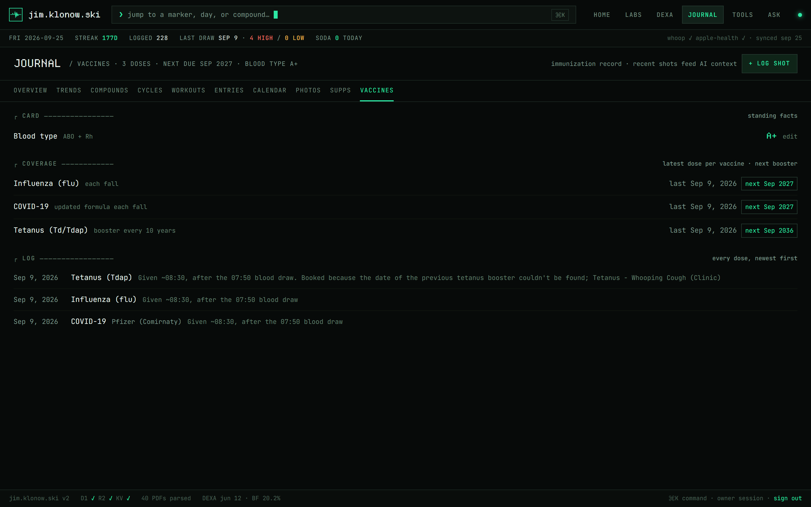
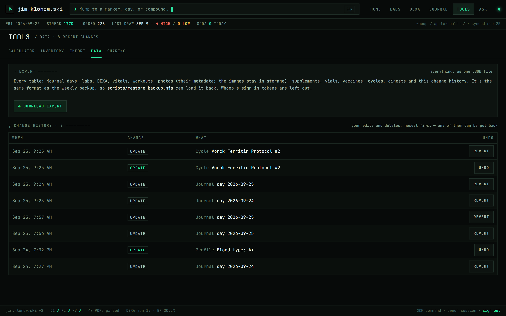

# jim.klonow.ski

Personal health tracking site. Bloodwork trends, body composition, and a daily peptide/TRT journal, with AI-generated recaps, Whoop sync, and role-based sharing — all in one place.

**▶ [Try the live demo](https://jim.klonow.ski/demo)** — no sign-up. One click drops you into the full app as a fictional persona with ~20 months of synthetic data: browse everything, edit journal days, open vials. Demo edits land in a shared sandbox database that resets nightly; nothing you see or touch is real health data.

## Screenshots


| `/labs` — bloodwork tracker | `/labs/dexa` — body composition |
|---|---|
|  |  |
| **`/journal` — daily log hub** | **`/journal/trends` — vitals + Whoop** |
|  |  |
| **`/ask` — AI analysis console** | |
|  | |

<details>
<summary><strong>More pages — journal spokes &amp; tools</strong></summary>

| `/journal/compounds` — active protocol + timeline | `/journal/workouts` — Apple + Whoop session log |
|---|---|
|  |  |
| **`/journal/cycle/[id]` — cycle dossier** | **`/journal/cycles` — cycle planner** |
|  |  |
| **`/journal/entries` — day-log ledger** | **`/journal/calendar` — month view + protocol timeline** |
|  |  |
| **`/journal/supplements` — standing stack** | **`/tools/calculator` — reconstitution & syringe units** |
|  |  |
| **`/journal/vaccines` — immunization record** | **`/tools/data` — export + change history** |
|  |  |
| **`/tools/sharing` — share links + sessions** | **`/tools/import` — Apple Health import + auto-sync** |
|  |  |

</details>

## Stack

- **Nuxt 4** + Vue 3 + TypeScript, on **Node ≥ 22.18** and **pnpm 11**
- **Nuxt UI v4** + Tailwind CSS v4 — "Phosphor Terminal" dark-only TUI theme (JetBrains Mono / Departure Mono)
- **Installable PWA** — standalone display, afib-heartbeat icon set (`public/`), iOS homescreen metas in `app/app.vue`
- **Cloudflare Workers** (Paid plan) — deployed via Wrangler (nodejs_compat), with cron triggers for the scheduled tasks
- **Cloudflare D1** — two databases: the real one (`DB`) and the demo sandbox (`DEMO_DB`), built and changed by numbered migrations
- **Cloudflare R2** — lab PDFs, progress photos, the demo seed, and the weekly database backups
- **Cloudflare KV** — rate limiting, and the "sign out other devices" cutoff
- **zod** — every request body and query string is validated against a schema in `shared/utils/schemas.ts`
- **nuxt-echarts** — trend charts
- **Anthropic SDK** — lab PDF parsing, protocol-aware lab summaries, daily/weekly health digests, freeform stock-dump parsing into inventory rows (structured output), and the `/ask` chat (models under **AI** below)
- **Whoop API** — OAuth sync for recovery, sleep, and workout data
- **@nuxtjs/seo** — per-page titles via a `%s | jim.klonow.ski` template (each page sets just its leaf name with `useSeoMeta`), inferred OG/Twitter cards over a shared `public/og.png`, and the robots rules under **Search engines and AI crawlers**

## Sections

| Route | Description |
|---|---|
| `/` | Overview dashboard — flagged markers, vitals, today's doses + the latest day's workouts, quick links, the latest daily and weekly AI digests (daily first) beside the TICKER companion, and a cycle strip when one is planned/running/recently ended — mid-cycle it carries a one-line passive vitals watch (sign-in prompt when signed out) |
| `/labs` | Bloodwork tracker — biomarker panels, trend charts, PDF sources, regenerable AI summaries; `?marker=<key>` deep-links to a marker's tab + detail modal (used by the home page's flagged rows and the ⌘K palette). A sticky **time scrubber** at the foot of the page rewinds the whole dashboard to any earlier draw — cards, tab counts, AI summary, and echo findings all read as they did then, markers missing from that panel carry forward dimmed and dated, and a hollow ring on each range bar marks where the newest reading sits; `?asof=<date>` deep-links a rewound view |
| `/labs/dexa` | DEXA body composition scans |
| `/labs/upload` | Upload a new lab PDF (parsed server-side into structured markers) — owner only |
| `/labs/login` | Owner password sign-in |
| `/share/[token]` | Public landing that exchanges a share link for a role session |
| `/demo` | Starts a 24-hour demo session on the synthetic sandbox and lands on the home dashboard with a short guided tour — see **Demo mode** |
| `/journal` | Hub — vital tiles with sparklines, today's doses + workout, soda/Whoop strip, and cards into each spoke below |
| `/journal/trends` | Every vitals + Whoop/Apple Watch chart under one shared range picker (30/60/90d/all, optional 7d smoothing) |
| `/journal/compounds` | Active protocol and every tracked compound — modeled exposure curves for the slow-release injectables (Bateman superposition of the dose log, lab draws overlaid) and a planned-vs-logged adherence panel scoring the standing cadence plus any planned cycles — linking out to the calculator and vial inventory |
| `/journal/cycles` | Cycle planner — named, dated protocol phases (e.g. "200 mg Primo weeks 1–16, Anavar weeks 12–16") stored week-relative to the start date, so shifting the start moves every phase. A start can also be pencilled in to a month or quarter (`start_precision`) — such a "not scheduled" cycle stays upcoming and derives nothing dated (no rings, adherence, or checkpoints) until a day is picked; editing owner only |
| `/journal/cycle/[id]` | Cycle dossier — plan bars by week, planned-vs-logged exposure overlay (the plan run through the same Bateman engine as the dose log), per-week adherence, derived lab checkpoints (baseline/mid/end/recovery windows) with gating-marker deltas vs the baseline draw, end-early/resume actions, and a **passive side-effect watch** (`shared/utils/cycleSignals.ts`) — weight, systolic BP, RHR, HRV, recovery, and sleep over the last 2 weeks vs the 4 weeks pre-start, noise-thresholded with the digest trend engine's floors, weight also rate-checked as the water-retention tell — derived from data that collects itself, deliberately in place of any symptom tracker |
| `/journal/workouts` | Session log merged from Apple Health + Whoop, with stat cells and type mix |
| `/journal/entries` | Day-log ledger of every journal row — hidden from the doctor role |
| `/journal/[date]` | Create or edit a day's entry (read-only for guests) — "copy from previous" mirrors each injection site (left glute → right glute) so sides rotate day to day |
| `/journal/calendar` | Month view with compound-colored dots, scheduled-dose rings (planned vs logged, from the standing `PROTOCOL_RULES` cadence merged with any planned cycles — an upcoming cycle previews its rings on future days) + protocol timeline (logged compounds, plus the standing meds in `STANDING_COMPOUNDS` that never enter the dose log; both live in `shared/utils/protocolRules.ts`) |
| `/journal/photos` | Progress photos — bulk upload, before/after compare slider, reframing |
| `/journal/compound/[name]` | Dosing history for a single compound, with a modeled exposure curve for the slow-release ones |
| `/journal/supplements` | Standing vitamin/supplement/skin stack (active, on-hand, discontinued) — feeds AI prompts; editing owner only |
| `/journal/vaccines` | Immunization record — one row per dose, grouped into per-vaccine coverage with next-due boosters (`shared/utils/vaccines.ts`), plus a profile card for standing facts like blood type. Recent shots reach the AI prompts as an acute-response caveat; readable by every role, editing owner only |
| `/tools/calculator` | Peptide reconstitution & syringe unit calculator — bridges IU↔mg for HGH/hCG when opened from a compound page (IU doses display their mg equivalent app-wide via `IU_PER_MG` in `shared/utils/peptideCalc.ts`) |
| `/tools/inventory` | Peptide vial inventory and depletion tracking — **✦ STOCK DUMP** has Claude parse a freeform "what's in the fridge" sentence into sealed-vial rows (structured output, corrected in a confirm table before saving), and a **runway panel** (`shared/utils/stockRunway.ts`) shows days-of-stock per compound at the logged pace plus whether the stockpile covers the remaining doses of the next planned cycle — owner only, plus the demo sandbox |
| `/tools/import` | One-time Apple Health XML import + Health Auto Export auto-sync webhook — owner only |
| `/tools/data` | Full JSON export (the weekly backup's format) and the change history, where any delete or overwrite can be put back — owner only |
| `/tools/sharing` | Mint, list, and revoke share links, and sign out your other devices — owner only |
| `/ask` | AI analysis console — streaming chat over the full tracked history (labs, DEXA, journal, Whoop, protocol) — owner only |
| `/privacy` | Privacy notice |

`/journal` is a hub-and-spoke section: the overview links into trends/compounds/workouts/entries, and every `/journal/*` page carries the same sub-nav (`app/components/journal/Nav.vue`), which drops tabs the current role can't open. `/tools` works the same way (`app/components/tools/Nav.vue`); its pages lived under `/journal` and `/labs` until the TOOLS section split (Aug 2026), and the old URLs 301 to the new ones. Site-wide chrome lives in `app/layouts/default.vue` — header nav, status line, the digest panel, a route-change loading bar, and a ⌘K command palette that jumps to any marker, day, or compound — including never-logged compound dossiers, searchable by brand name ("primo", "cialis").

## Auth & sharing

Cookie sessions are HMAC-signed tokens (key: `LABS_SECRET`) carrying one of four roles:

- **owner** — logs in with `LABS_PASSWORD`; full read/write. Lab uploads, lab JSON saves, and summary regeneration also need a 9-digit `LABS_UPLOAD_PIN` (a second-factor cookie, 12h).
- **friend** — read-only mirror of the whole site, except the owner's management pages (upload, import, data, sharing, inventory) and `/ask`.
- **doctor** — the clinical record: labs and DEXA, the journal hub, vitals and protocol trends, compounds and their dossiers, workouts, the calendar, the calculator, supplements, vaccines, and planned cycles. Daily entries, the `/journal/entries` ledger, photos, and digests are off-limits, and the journal list the doctor receives has food, sodas, and notes blanked server-side. The allowlist is `DOCTOR_PAGES` in `shared/utils/access.ts`; anything not on it is denied.
- **demo** — self-serve, credential-free 24h session minted by visiting [`/demo`](https://jim.klonow.ski/demo) (replaces whatever session cookie is present). Sees and edits only the synthetic sandbox — see **Demo mode** below. Blocked from the AI, upload, import, data, and sharing pages.

Guests never get a password: the owner mints **share links** (`/share/<token>`) from `/tools/sharing`, each with a role, redemption expiry, and use limit, backed by the `invites` D1 table, which stores only a SHA-256 of each link's token. Revoking a link also invalidates every session minted from it — guest requests re-check invite liveness. Sign-in/sign-out live in the footer status bar.

Owner sessions are self-contained signed tokens, so **Sign out other devices** on `/tools/sharing` is how one ends early: it stores a cutoff time in KV, and every owner session and upload-PIN unlock issued before it stops working (this device gets a fresh token). It can take up to a minute to reach every Cloudflare location.

Enforcement is layered: `server/middleware/auth.ts` verifies the cookie once per request and gates page navigation, `shared/utils/access.ts` holds the role→page policy shared with the client route middleware, and every API handler asserts its own requirement (`requireLabsAuth` / `requireOwner` / `requireRole` in `server/utils/auth.ts`).

The Apple Health webhook authenticates with a `WEBHOOK_TOKEN` bearer token — its own secret, never `LABS_SECRET`, so the iOS app never holds the cookie-signing key. The route fails closed when the token isn't configured. Every secret the Worker reads is listed in `.env.example`; set them in production with `wrangler secret put <NAME>`.

## Demo mode

Visiting **[/demo](https://jim.klonow.ski/demo)** mints a demo-role session and lands on the home dashboard, where a short guided tour (Nuxt UI's `useTour`) introduces the app. Everything a demo visitor reads or writes is transparently routed to a **second D1 database** (`DEMO_DB`) by the one-line role branch in `getDb()` (`server/utils/db.ts`) — every endpoint works unchanged, and a demo cookie can never see or touch real data. What demo gets:

- A fully **synthetic persona**: ~20 months of journal vitals and doses, 9 lab draws with story arcs (ApoB 108→71, a TRT start with the expected LH/FSH suppression and hematocrit creep), 4 DEXA scans, daily sleep/recovery metrics, workouts, a supplement stack, and a vial inventory that lines up with the logged doses.
- **Sandboxed writes** — journal days, sodas, supplements, and vials are editable (`requireWriteAccess` guard); demo visitors share the sandbox until it resets.
- **Canned AI** — TICKER digests and lab summaries are pre-written into the seed; no live Anthropic calls, and `/ask`, uploads, imports, the data page, and sharing stay owner-only.
- **Nightly reset** — the `demo:reset` task (09:00 UTC cron) wipes the sandbox and reseeds it from `demo/seed.json` in R2, re-anchoring every relative date so the data always ends "yesterday".

The persona is generated deterministically by `scripts/demo/generate-demo-data.mjs` (committed seed: `scripts/demo/demo-seed.json`) and loaded with `pnpm demo:seed:local` / `pnpm demo:seed:remote`. Progress photos are neutral placeholder silhouettes under `demo/` keys in the photos bucket; the photo proxy refuses any non-`demo/` key to a demo session.

## Security

Hardening beyond auth is handled by [nuxt-security](https://nuxt-security.vercel.app/), configured in `nuxt.config.ts`:

- **Security headers** on every SSR response: a nonce-based CSP (`script-src 'strict-dynamic'`; `img-src` also allows `blob:` for photo-upload previews), HSTS, `frame-ancestors 'self'`, `X-Content-Type-Options: nosniff`, COOP/CORP, and a Permissions-Policy that disables camera/mic/geolocation. `Referrer-Policy: no-referrer` keeps share-link tokens out of outbound referrers. Everything on the site is self-hosted (fonts, scripts, images), so the CSP needs no third-party allowances.
- **Subresource integrity** hashes on build assets; `console.log`/`console.debug` and `debugger` statements are stripped from production app builds (server/api logging is untouched, so `wrangler tail` keeps working).
- **Request size limits**: 2 MB standard bodies / 8 MB multipart globally, raised per-route for the raw-binary photo upload (25 MB) and multipart lab-PDF upload (20 MB).
- **Rate limiting** (KV-backed, per-IP via `cf-connecting-ip`) on the credential endpoints (`/api/labs/auth`, `/api/labs/upload-auth`), share-link redemption, demo entry (`/demo`), and `/api/ai/ask`; disabled everywhere else so ordinary requests never touch KV.

Deliberately not enabled — with reasoning in the config comments: `xssValidator` (false-positives on freeform journal text; Vue escaping + CSP cover XSS), `corsHandler` (same-origin API), `allowedMethodsRestricter` (nitro's file-based method routing already 405s), CSRF tokens (cookies are `httpOnly`/`secure`/`sameSite: lax`).

The lab-PDF proxy only serves flat lab-PDF names (`isLabPdfKey`). The labs bucket also holds the demo seed and the database backups, and the proxy would otherwise have served those to any signed-in guest who guessed a key.

### Search engines and AI crawlers

Only the public pages are meant to be indexed: the home page and `/privacy`. Both halves of that live in `nuxt.config.ts`:

- **`robots.txt`** disallows `/labs`, `/journal`, `/tools`, `/ask`, `/share`, and `/demo`. A crawled `/demo` would mint a session, and everything else only ever shows a crawler a login redirect. `/api` is deliberately left out, since blocking it can break Google's render of pages that fetch client-side.
- **Route rules** (`robots: false`) send `X-Robots-Tag: noindex` on the private sections and keep them out of the sitemap.
- **AI-usage directives** in the `*` group (`Content-Usage: train-ai=n, search=y` and `Content-Signal: search=yes, ai-train=no, ai-input=no`) say search indexing yes, training and live AI-answer fetching no. They're advisory. Cloudflare's "Block AI bots" rule enforces the same thing at the edge.

## Data & integrations

- All entries (journal, labs, DEXA, health metrics, workouts, vials, cycles, digests, invites) live in **D1**. `server/database/schema.sql` is the commented schema. The databases themselves are built and changed by the numbered wrangler migrations in `server/database/migrations`.
- Lab PDFs and progress photos are stored in **R2**, served through authenticated proxy routes; parsed marker data is written to D1 alongside a Claude-generated summary.
- **Whoop** OAuth sync (`server/api/whoop/*`, `server/tasks/whoop/sync.ts`) pulls recovery/sleep/workout data on a schedule into `health_metrics` and `workouts`.
- **Apple Health** data + workouts sync automatically via the [Health Auto Export](https://www.healthyapps.dev/) iOS app, which POSTs to the webhook at `server/api/journal/health-webhook.post.ts` (a one-time Apple Health XML import lives at `/tools/import`).
- Scheduled **digests** (`server/tasks/digest/daily.ts`, `weekly.ts`) have Claude summarize the period's vitals, doses, sleep, and workouts — anchored to protocol change-points detected from the dose log (`shared/utils/trends.ts`) — into a short recap stored in the `digests` table and surfaced on the home dashboard (`app/components/home/Digest.vue`, daily above weekly) and in the all-digests slide-over (`DigestPanel.vue`).
- The **AI lab summary** (`server/api/labs/generate-summary.post.ts`) compares each draw against prior draws with protocol context (current compounds + recent start/stop events + where the draw landed on each injectable's modeled exposure curve — `shared/utils/pk.ts`, so a near-peak vs near-trough draw isn't misread as a real change) and can be regenerated from the labs dashboard.
- The **`/ask` console** (`server/api/ai/ask.post.ts`) streams answers to freeform questions over a per-request fact sheet built by `server/utils/askContext.ts` — every lab draw, every DEXA scan, all-time compound history, precomputed trends, and recent daily detail. Owner-only and KV rate-limited, since every question is an Anthropic call.
- All three AI surfaces share standing protocol context: the intended dosing schedule (generated by `shared/utils/protocolProse.ts` from the same `PROTOCOL_RULES` the adherence panel scores against, plus standing meds that never hit the dose log and as-needed compounds), dated one-off notes (`shared/utils/protocolEvents.ts`), the supplement stack rendered live from the `supplements` table (so edits on `/journal/supplements` reach the prompts without a deploy), and planned-cycle context from the `cycles` table — an upcoming cycle flags the need for a baseline draw, an active one tells the model which day/week the period falls on and to compare gating markers (HDL, ALT/AST, hematocrit, ferritin, estradiol) against the named baseline draw and hands it the passive vitals watch precomputed (flagged/watch/steady per metric, so it narrates deterministic numbers rather than re-deriving them), a not-yet-scheduled one (month/quarter precision) is described as intent rather than a schedule — no start date to count toward, plus whether the latest draw is fresh enough to serve as its baseline — and a recently ended one frames the recovery window. All of it as-of-date aware, since lab summaries can regenerate for historical draws.

### AI

Every model choice is one line in `AI_MODELS` (`server/utils/ai.ts`):

| Task | Model |
|---|---|
| `/ask` chat, daily and weekly digests | Claude Sonnet 5 (`claude-sonnet-5`) |
| Lab / DEXA / echo PDF extraction, lab summaries, stock-dump parsing | Claude Opus 5.5 (`claude-opus-5-5`) |

All of it is server-side and owner-only (the demo reads canned digests and summaries from its seed). Each database-backed block of prompt context (supplements, cycles, vaccines) has its own file in `server/utils/`.

## Architecture

- **`shared/`** is code both the app and the server use: domain math (cycles, trends, PK curves, stock runway, vaccines), the protocol rules and prose, request schemas, the access policy, and the `/api/health` rules. It imports nothing from Nuxt or h3, and its relative imports carry an explicit `.ts`, so `node --test` loads it directly under Node's type stripping. That's what the unit tests exercise.
- **Validation.** Request shapes are zod schemas in `shared/utils/schemas.ts`. Handlers read them through `readValidatedJson` / `validatedQuery` (`server/utils/validate.ts`), so a bad field is a 400 that names it rather than a 500 from a D1 bind.
- **Reads.** List endpoints go through `listRows` (`server/utils/db.ts`), which routes demo sessions to `DEMO_DB`. Responses carry an ETag (`server/utils/etag.ts`) and `Cache-Control: private, no-cache`, so the browser revalidates and gets an empty 304 when nothing changed. Date-keyed lists accept `?from=YYYY-MM-DD&to=YYYY-MM-DD`. On the client, every list comes from `useListResource` (`app/composables/useListResource.ts`), which shares one cached copy per key across pages and revalidates in the background on client-side navigation.
- **Writes and forms.** `useSaveAction` wraps each save or delete (pending flag, double-submit guard, success toast, and a failure toast that shows the server's message). `useDirtyGuard` warns before leaving a form with unsaved edits.
- **Change history.** Owner writes to the tracked tables record the row as it was before (`server/utils/audit.ts`, the `audit_log` table), and `/tools/data` can put any of them back. That stands in for a `deleted_at` column on every table. Demo-sandbox writes and automated ones (webhook, Whoop sync, digests) aren't recorded.
- **Theme layers.** Colors are `@theme` tokens in `app/assets/css/main.css`. Component-wide looks (floating-panel chrome, field wells, form labels, tables) are set once in `app/app.config.ts`. Charts and inline styles, which need literal colors, read the hex twins in `app/utils/chartTheme.ts`, and `tests/theme.test.mjs` fails if those drift from the CSS tokens.
- **Database.** Numbered migrations in `server/database/migrations` build and change both databases, and each database records what it has applied in `d1_migrations`. `server/database/schema.sql` is the commented snapshot for reading; `tests/migrations.test.mjs` replays every migration in SQLite and fails if the result differs from it.
- **One Vue version.** `pnpm-workspace.yaml` pins `vue` and every `@vue/*` package to a single catalog line. Mixed Vue patch releases once broke every page with a link during production SSR.

## Scheduled tasks

Cloudflare fires the crons in `wrangler.jsonc` `triggers.crons`, and `server/schedule.ts` maps each to its Nitro tasks (`server/tasks/`). `tests/schedule.test.mjs` holds the two lists equal. Times are UTC; Chicago is 5 hours behind in summer, 6 in winter.

| Cron | Task | What it does |
|---|---|---|
| `0 9 * * *` | `demo:reset` | Wipes the demo sandbox and reseeds it from R2, dates re-anchored to yesterday |
| `0 11 * * *` | `whoop:sync` | Pulls recovery, sleep, strain, and workouts from Whoop |
| `0 14 * * *` | `digest:daily` | Writes yesterday's recap |
| `0 15 * * SUN` | `digest:weekly` | Writes the recap of the Sunday–Saturday week just ended |
| `0 8 * * SUN` | `db:backup` | Snapshots the main database to R2 as gzipped JSON, keeping 12 weeks |
| `0 8 * * SUN` | `audit:purge` | Removes the files of photos deleted 30+ days ago, and change-history entries older than a year |

Days of the week are always written as names. Cloudflare numbers them 1 = Sunday … 7 = Saturday, so a digit means something different than it does in most crons, and a `0` fails the deploy. A cron's tasks run concurrently.

### Monitoring and backups

- Every task runs through `runLoggedTask` (`server/utils/taskRuns.ts`). It records each run in the `task_runs` table and then lets a failure through, so the cron invocation fails in Cloudflare's log too.
- `GET /api/health` returns `{ ok }` with 200 or 503, for an uptime monitor to watch. It fails when a task is overdue against its window (`TASK_STALE_AFTER_HOURS` in `server/schedule.ts`), when a task's latest run failed, or when the Apple Health or Whoop feeds stop arriving. Only the owner sees the per-check detail.
- The weekly backup lands in the labs bucket under `backups/d1/`, which the PDF proxy refuses to serve. To restore one, or an export from `/tools/data`, turn it back into SQL with `scripts/restore-backup.mjs`; its header has the steps. Rehearse on `--local` first. D1 Time Travel separately covers any point in the last 30 days.

## Configuration

Every secret the Worker reads is listed, with notes, in `.env.example`. Copy it to `.env` for local development; in production set each with `npx wrangler secret put <NAME>`.

| Variable | Used for |
|---|---|
| `LABS_SECRET` | HMAC key for the session and upload-PIN cookies. Rotating it signs everyone out |
| `LABS_PASSWORD` | Owner sign-in at `/labs/login` |
| `LABS_UPLOAD_PIN` | Second factor for lab uploads, JSON saves, and summary regeneration |
| `WEBHOOK_TOKEN` | Bearer token Health Auto Export sends to the Apple Health webhook (its own secret; the webhook refuses everything while it's unset) |
| `ANTHROPIC_API_KEY` | Every AI call |
| `WHOOP_CLIENT_ID`, `WHOOP_CLIENT_SECRET` | Whoop OAuth app credentials, for connecting and the nightly sync |

Bindings (the D1 databases, R2 buckets, and KV namespace) are declared in `wrangler.jsonc`; `pnpm types` regenerates their TypeScript types in `worker-configuration.d.ts`.

## Dev

Requires Node 22.18 or newer (the tests and scripts rely on its built-in TypeScript type stripping) and pnpm 11.

```bash
pnpm install
pnpm dev              # HTTPS dev server on port 3000
pnpm check            # types, lint, typecheck, tests (what pnpm deploy runs first)
pnpm test             # unit tests (node --test over tests/*.test.mjs, no framework)
pnpm test:watch       # the same, rerunning on change
pnpm types            # regenerate worker-configuration.d.ts after editing wrangler.jsonc
pnpm db:new <name>    # new numbered migration in server/database/migrations
pnpm db:migrate       # apply pending migrations to both local DBs (main + demo)
pnpm db:status        # applied/pending per local DB (db:status:remote for the real ones)
pnpm sync:local       # mirror prod -> local: D1 dump/import + R2 objects (stop the dev server first)
pnpm sync:local:r2    # top up local R2 objects only (PDFs/photos referenced by local D1)
pnpm demo:generate    # regenerate the synthetic demo persona (scripts/demo/demo-seed.json)
pnpm demo:seed:local  # wipe + reseed the local demo sandbox DB and R2 objects
pnpm demo:seed:remote # same against the production DEMO_DB + buckets
```

The dev server runs over HTTPS so secure cookies work locally. Its host and certificate paths are `devServer` in `nuxt.config.ts`; point them at your own locally trusted certificate (e.g. from mkcert) in `certs/`, which is gitignored. D1, R2, and KV are emulated locally under `.wrangler/state`.

`pnpm sync:local` clears all local D1 state, the demo DB included. Afterwards run `pnpm db:migrate`, which rebuilds the empty demo DB and applies anything newer than prod, then `pnpm demo:seed:local`.

## Deploy

```bash
pnpm deploy     # pnpm check, then nuxt build, then wrangler deploy
pnpm preview    # build, then run the built Worker in Wrangler's local emulator
```

The build generates the real deploy config. Nitro writes `.output/server/wrangler.json`, which is `wrangler.jsonc` with the Worker entry point and static assets pointed at the build output, plus a `.wrangler/deploy/config.json` that redirects `wrangler deploy` to it. That's why the deploy log warns that `main` and `assets` are overridden. Edit `wrangler.jsonc`, never the generated file.

Schema changes are numbered migrations (`pnpm db:new <name>`), mirrored into `server/database/schema.sql` in the same change. Apply them to both remote databases **before** deploying code that needs them:

```bash
pnpm db:migrate:remote   # main + demo; each asks for confirmation
```

The one-off files applied by hand before the migrations ledger existed are in `server/database/archive`.

CI (`.github/workflows/ci.yml`) runs lint, typecheck, the tests, and a production build on every push, on Node 22 and 24. It doesn't deploy.
